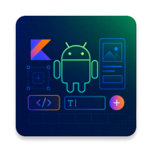
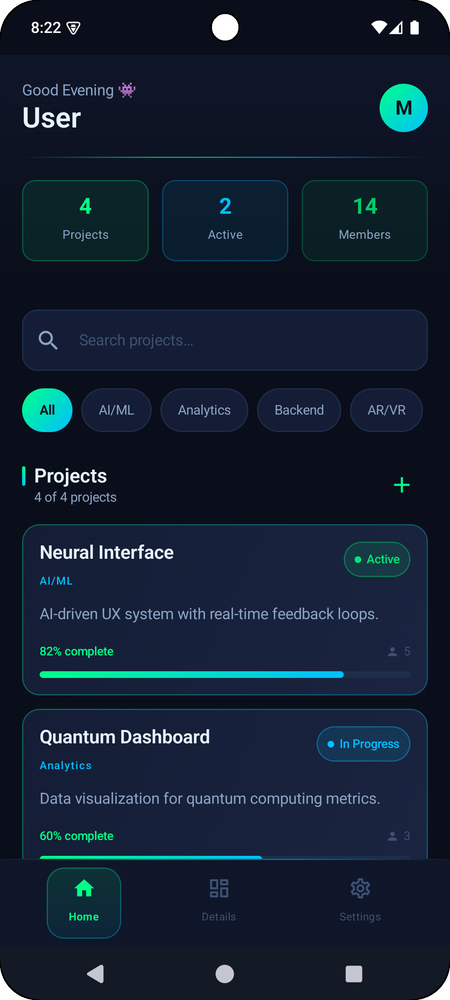
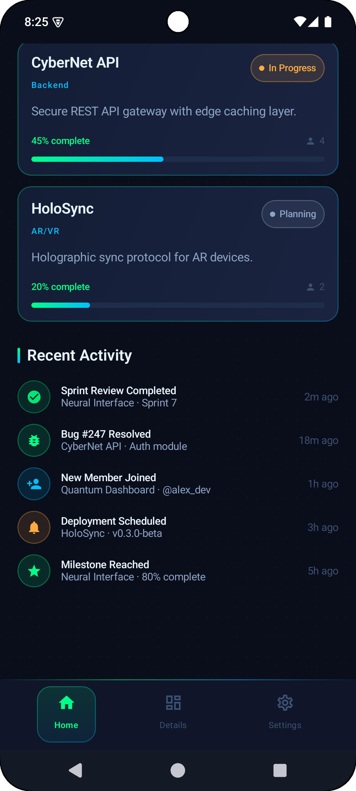
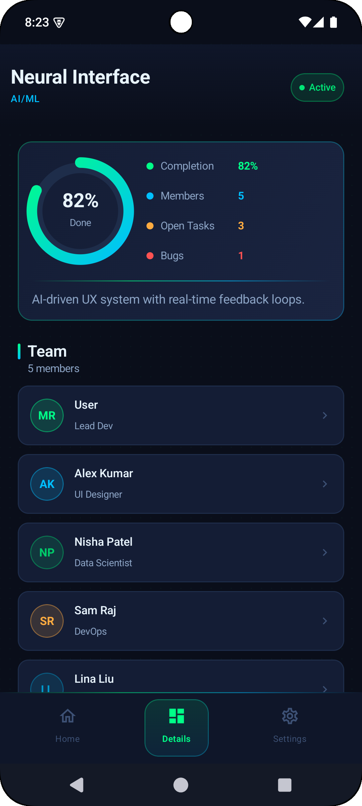
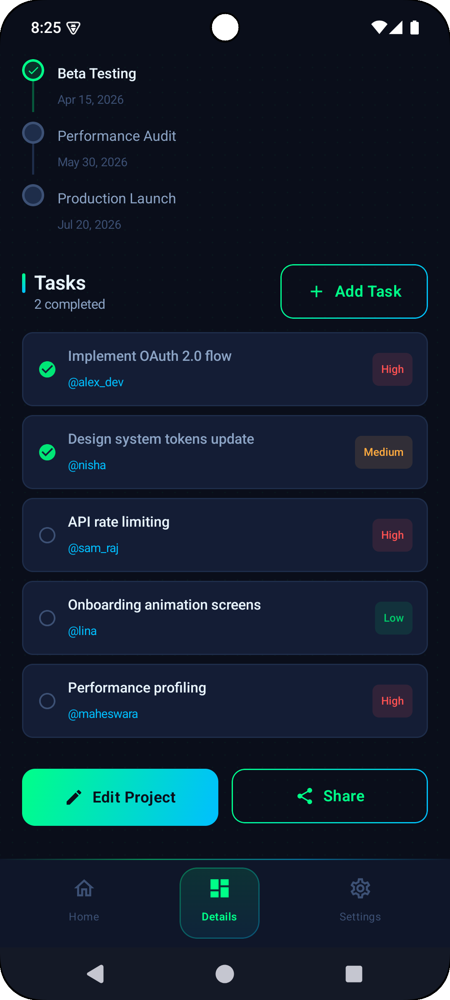
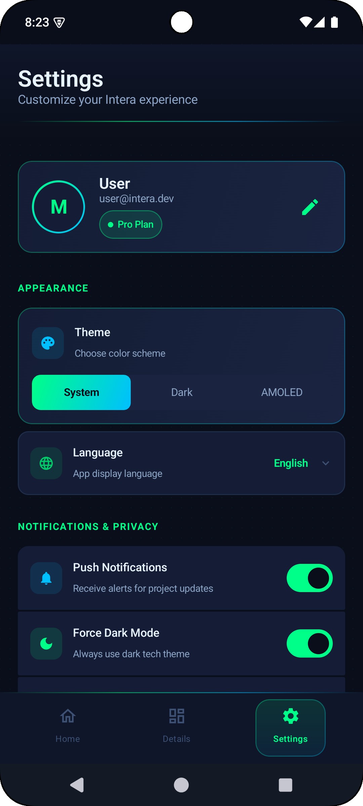
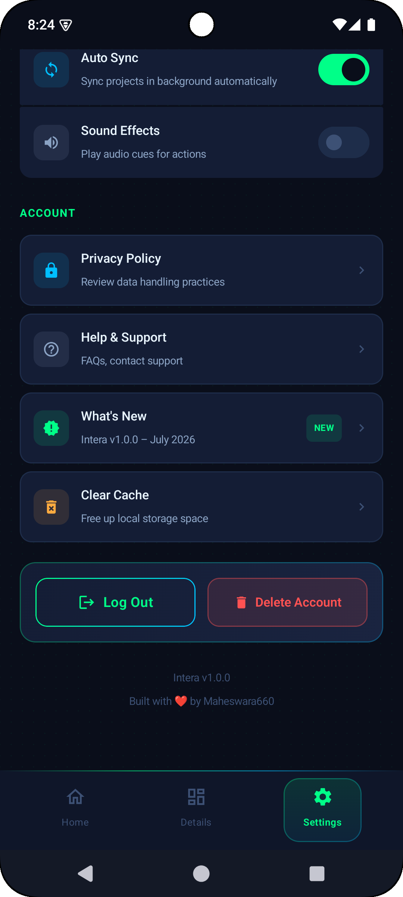

<div align="center">



# Intera

**A modern dark-themed Android project management app**

[](https://apexplanet.in)
[](https://developer.android.com)
[](https://kotlinlang.org)
[](https://developer.android.com/jetpack/compose)
[](LICENSE)
[](#internship-context)

</div>

---

## Overview

**Intera** is a sleek, dark-themed Android project management application built entirely with **Jetpack Compose**. The app adopts a minimal *dark tech* aesthetic with neon green (`#00FF88`) and electric blue (`#00BFFF`) accents, delivering a premium developer-dashboard feel while adhering to Material Design 3 principles.

Developed as part of **Task 2 — Designing & Implementing UI/UX** of the [ApexPlanet Software Pvt. Ltd.](https://apexplanet.in) internship program, Intera demonstrates a complete, production-quality Compose UI stack — from design tokens and a reusable component library through to multi-screen navigation with animated transitions.

---

## Screenshots

### Home Screen

| Projects Overview | Recent Activity |
|:-:|:-:|
|  |  |
| Search bar, category filter chips, live-updating project cards with neon progress bars | Real-time activity feed with timestamped events |

### Details Screen

| Project Metrics | Milestones & Tasks |
|:-:|:-:|
|  |  |
| Animated circular progress ring, team roster with role badges | Milestone timeline and prioritized task list |

### Settings Screen

| Appearance & Privacy | Account Management |
|:-:|:-:|
|  |  |
| Segmented theme picker, language selector, 6 toggle controls | Action rows, danger-zone logout / delete, version footer |

---

## Features

<details>
<summary><strong>🏠 Home Screen</strong></summary>

- Greeting header with user avatar and live stat chips (Projects · Active · Members)
- Full-text live search with instant filtering across project titles and descriptions
- Horizontal category filter chips: All · AI/ML · Analytics · Backend · AR/VR
- Project cards showing title, category, status badge, description, member count, and animated neon progress bar
- Recent activity feed with icon, event title, context subtitle, and relative timestamp

</details>

<details>
<summary><strong>📊 Details Screen</strong></summary>

- Animated circular progress ring drawn on Canvas with an 800 ms ease-in-out animation
- Four-metric grid: Completion % · Team Members · Open Tasks · Open Bugs
- Team member roster with colour-coded avatar initials and role labels
- Milestone timeline with green checkmarks for completed milestones
- Task list with assignee handles and High / Medium / Low priority badges
- Edit Project and Share action buttons

</details>

<details>
<summary><strong>⚙️ Settings Screen</strong></summary>

- Profile card with gradient avatar ring, email, and plan badge
- Segmented theme picker: System · Dark · AMOLED
- Language dropdown: English · Hindi · Tamil · Telugu
- Six toggle rows with icons: Push Notifications, Force Dark Mode, Usage Analytics, Biometric Lock, Auto Sync, Sound Effects
- Account action rows: Privacy Policy, Help & Support, What's New (with NEW badge), Clear Cache
- Danger zone: Log Out (outline) and Delete Account (destructive red) buttons
- Version footer

</details>

<details>
<summary><strong>🧭 Navigation</strong></summary>

- Type-safe Navigation Compose with slide + crossfade screen transitions (300 ms)
- Custom bottom navigation bar with neon gradient active-state highlight
- Persistent back stack with proper lifecycle management

</details>

---

## Tech Stack

| Layer | Technology | Version |
|---|---|---|
| Language | Kotlin | 2.2.10 |
| UI Framework | Jetpack Compose BOM | 2026.02.01 |
| Material Design | Compose Material 3 | 1.4.0 |
| Navigation | Navigation Compose | 2.9.0 |
| Icons | Material Icons Extended | 1.7.8 |
| Lifecycle | Lifecycle Runtime KTX | 2.11.0 |
| XML Theme Base | AndroidX AppCompat | 1.7.0 |
| Core Extensions | AndroidX Core KTX | 1.19.0 |
| Build System | Android Gradle Plugin | 9.3.0 |
| Min SDK | Android 7.0 Nougat | API 24 |
| Target / Compile SDK | Android 15+ | API 37.0 |

---

## Project Structure

```
Intera/
├── assets/                              ← Screenshots & app icon
│   ├── app_icon.webp
│   ├── home.png
│   ├── home_recents.png
│   ├── details.png
│   ├── details_tasks.png
│   ├── settings.png
│   └── settings_account.png
│
├── app/src/main/
│   ├── AndroidManifest.xml
│   ├── java/com/maheswara660/intera/
│   │   ├── MainActivity.kt              ← App entry point & edge-to-edge setup
│   │   └── ui/
│   │       ├── theme/
│   │       │   ├── Color.kt             ← Full dark tech colour palette (12 tokens)
│   │       │   ├── Theme.kt             ← Forced-dark MaterialTheme wrapper
│   │       │   └── Type.kt              ← Typography scale
│   │       ├── components/
│   │       │   └── Components.kt        ← Shared reusable design-system components
│   │       ├── screens/
│   │       │   ├── ProjectData.kt       ← Shared data models & sample data
│   │       │   ├── HomeScreen.kt        ← Home screen
│   │       │   ├── DetailsScreen.kt     ← Project detail screen
│   │       │   └── SettingsScreen.kt    ← App settings screen
│   │       └── navigation/
│   │           └── Navigation.kt        ← NavHost + custom bottom navigation bar
│   └── res/
│       ├── drawable/
│       │   ├── ic_launcher_background.xml   ← Dark gradient background
│       │   └── ic_launcher_foreground.xml   ← Custom Android mascot + circuit icon
│       └── values/
│           ├── colors.xml               ← XML colour resources
│           ├── strings.xml              ← String resources
│           └── themes.xml               ← AppCompat-based XML theme
│
├── gradle/libs.versions.toml            ← Centralised version catalog
├── LICENSE                              ← GNU General Public License v3.0
└── README.md
```

---

## Design System

### Colour Palette

| Token | Hex | Usage |
|---|---|---|
| `DarkNavy` | `#0A0E1A` | Main screen background |
| `DarkSurface` | `#0F1629` | Headers, top bars |
| `CardSurface` | `#141D35` | Cards, list rows |
| `ElevatedCard` | `#1A2440` | Elevated / modal surfaces |
| `NeonGreen` | `#00FF88` | Primary accent, active states, success |
| `NeonGreenDim` | `#00CC6A` | Dimmed green |
| `ElectricBlue` | `#00BFFF` | Secondary accent, icons, info |
| `ElectricBlueDim` | `#0099CC` | Dimmed blue |
| `TextPrimary` | `#E8F4FD` | Headings, body text |
| `TextSecondary` | `#8BA3C4` | Subtitles, hints |
| `TextDisabled` | `#3D5175` | Placeholder, disabled text |
| `WarningAmber` | `#FFB300` | Warning states |
| `ErrorRed` | `#FF4444` | Destructive actions |

### Component Library (`Components.kt`)

| Component | Description |
|---|---|
| `InteraCard` | Gradient-bordered dark card with optional click ripple |
| `InteraButton` | Green → Blue gradient CTA button |
| `InteraOutlineButton` | Neon green ghost/outline button |
| `SectionHeader` | Section title with left neon accent bar |
| `StatChip` | Metric label + value chip |
| `NeonProgressBar` | Animated gradient progress bar |
| `StatusBadge` | Dot + label status pill |
| `NeonDivider` | Horizontal green → blue gradient separator |
| `drawDotGrid()` | Canvas extension for decorative dot-grid background |

---

## Getting Started

### Prerequisites

| Requirement | Version |
|---|---|
| Android Studio | Meerkat 2024.3.2 or newer |
| JDK | 11 or newer |
| Android SDK Platforms | API 24 through 37.0 |
| Kotlin Plugin | 2.2.x |

### Clone

```bash
git clone https://github.com/<your-username>/Intera.git
cd Intera
```

### Build & Run

**Using Android Studio:**

1. Open the project folder in Android Studio
2. Let Gradle sync complete automatically
3. Select an emulator or physical device (API 24+)
4. Press **▶ Run**

**Using the command line:**

```bash
# Assemble debug APK
./gradlew assembleDebug

# Install directly onto a connected device
./gradlew installDebug

# Full clean build
./gradlew clean assembleDebug
```

The output APK is located at:
```
app/build/outputs/apk/debug/app-debug.apk
```

---

## Internship Context

| Field | Details |
|---|---|
| **Company** | ApexPlanet Software Pvt. Ltd. |
| **Program** | Android App Development — 45 Days |
| **Internship ID** | APSPL2642901 |
| **Duration** | 21 July 2026 – 03 September 2026 |
| **Task** | Task 2 — Designing & Implementing UI/UX |
| **Timeline** | Days 10–18 |
| **Status** | ✅ Completed |

**Activities completed during this task:**

- Designed wireframes and mockups using Antigravity AI
- Implemented responsive Compose layouts following Material Design 3 guidelines
- Built a reusable component library and full design-token system
- Implemented animated multi-screen navigation (Home → Details → Settings)
- Applied a consistent dark tech theme, colour palette, and typography scale
- Created a custom adaptive app icon (Android mascot + geometric circuit motif)
- Verified UI across multiple emulator screen sizes and API levels

---

## License

This project is licensed under the **GNU General Public License v3.0**.

> You are free to use, study, share, and modify this software under the terms of the GPL v3.
> Any derivative work must also be distributed under the same license.

See the full license text in [`LICENSE`](LICENSE).

---

<div align="center">

Built with ❤️ by **Maheswara660** · ApexPlanet Internship · APSPL2642901

</div>
